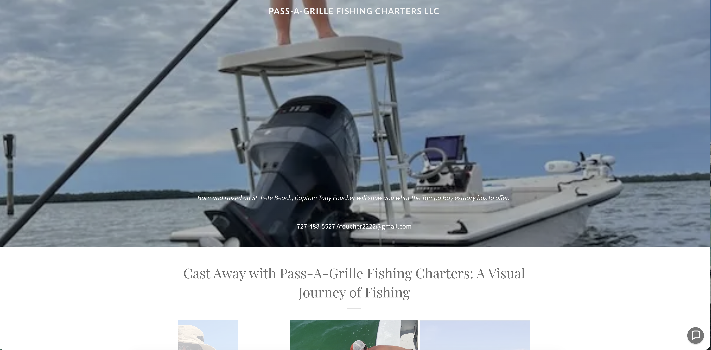
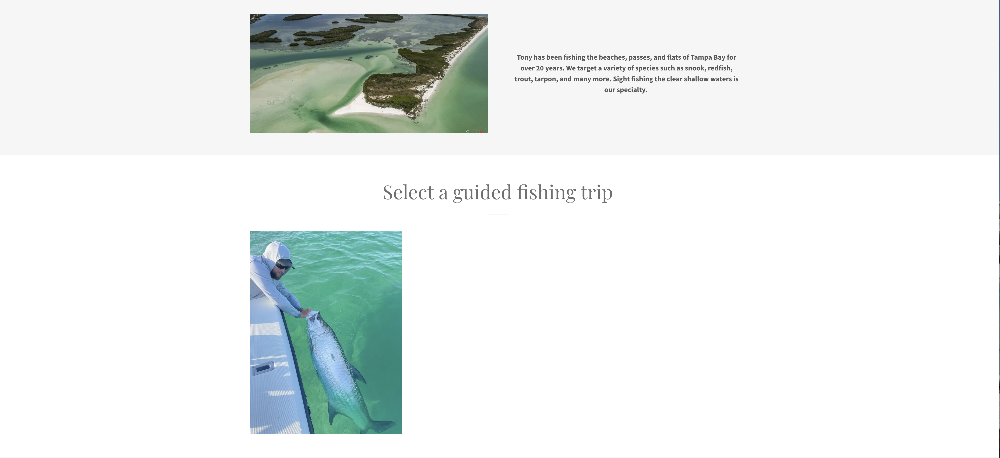
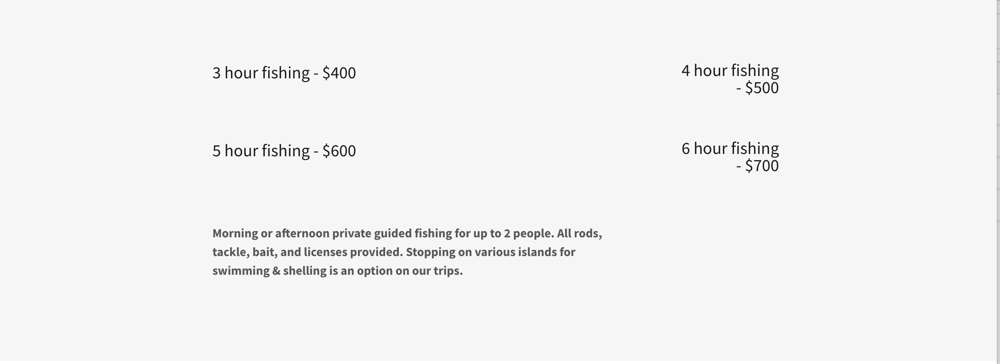

# UX Research Case Study: Fishing Charter Booking Experience 

## Overview 
This project investigates why individuals interested in fishing charter expereinces do not consistently convert from initial interest to confirmed bookings. The goal is to understand how users disvover, evaluate, and trust charter services and where breakdowns occur in that decision-making process.

---

## My Role
UX Researcher Strategist
Mixed Methods Researcher 
AWS Certified (Cloud-Aware Systems Thinking)

---

## Problem Statement
Individuals interested in booking fishing charter experiences are not consistently progressing from initial interest to confirmed reservations, indicating breakdowns in how services are discovered, evaluated, and trusted during the decision-making process.

---

## Current Experience Audit (Pre-Research Observations)

### Hero Section

> The hero section lacks a clear and compelling value proposition. While visually engaging, it does not immediately communicate what differentiates this charter service or why users should choose it.

### Experience Gallery

> The gallery provides visual proof of successful fishing outcomes but lacks diversity in the experience being communicated. Images primarily focus on individuals holding fish, offering limited insight into the broader experience such as group interaction, environment, process, or amenities.

### About & Trust Section

> Trust signals are present but not prominently communicated. While the captain’s experience and local knowledge are mentioned, this information is not positioned in a way that builds strong confidence or reassurance during the decision-making process.

### Pricing & Booking

> The pricing section presents cost information but lacks clarity around what each package includes and how the experiences differ. This creates uncertainty in evaluating value and may lead to hesitation during decision-making.

---

## Research Approach 
This project uses a grounded-theory-informed qualitative research approach: 
- Semi-structured interviews
- Behavioral participant segmentation
- Interative coding and thematic analysis
- Constant comparision across participants
---
## What I'M Investigating
- How users discover charter services
- How they evaluate and compare options
- What builds or breeaks trust
- Where hesitation and drop-off occur
- What defines a valuable experience 
---

## Project Status 
✅ Research Plan Complete  
🔄 User Interviews (Next Phase)  
🔲 Synthesis & Insights  
🔲 Design Recommendations  
🔲 Wireframes & Testing  

---

## Repository Structure

- `01-project-overview/` → Project framing  
- `02-research-plan/` → Full research design  
- `04-user-research/` → Interview guide & recruitment  

---

## Why This Matters 
This project focuses on real user behavior. Not assumptions. 
By understanding how people actually make decisions, this research aims to inform more effective, trustworthy, and user-centered digital experience.

---

## Next Steps
- Conduct interviews
- Analyze patterns using grounded theory
- Identify key friction points and opportunity areas
- Translate findings into design strategy

---
## Key Hyopthesis 
I suspect that users are not primarily seeking fishing itself, but a broader experience (e.g., social connection, novelty, or relazation), and that current offerings may not clearly communicate this value, leading to hesitation in booking a fishing charter. 

